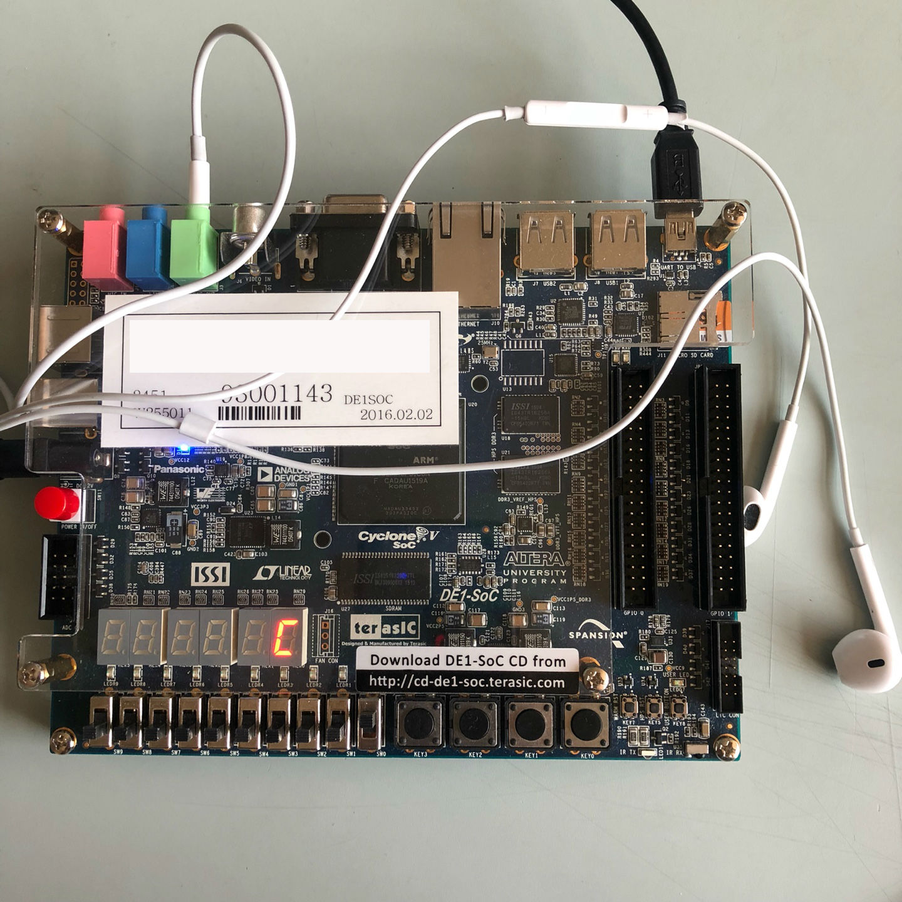

> Using DE1-SOC Audio CODEC, Played `twinkle twinkle little star`.


# Background
The DE1-SoC board is equipped with an audio CODEC capable of sampling sound from a microphone and providing it as input to a circuit. By defalut, the CODEC provides 48000 samples, which is sufficient to accurately represent audible sounds.


# Notes
<b>IMPORTANT</b> : Must write to both left and right FIFOs. If either FIFO is empty, nothing is sent to the audio CODEC.


# Device driver kernel programming - sw & hex
`sw.c` and `hex.c` are both developed as a kernel side program. So  `Makefile` is needed and We must register the device drivers.

Compile and Loading.

```bash
$make
$insmod sw.ko
$insmod hex.ko
```

Once it finished, Create device driver files.

```bash
$mknod /dev/sw c 238 0
$mknod /dev/hex c 240 0
```

And Execute it.

```bash
$gcc audio audio.c -lm
$./audio
```

# Result Image
If sw1 is set, then can hear C sound through that audio.


If sw7 is set, `twinkle twinkle little star` is going to be played.


# Reference
- <http://www-ug.eecg.utoronto.ca/desl/nios_devices_SoC/dev_audio.html>
- <https://www.intel.com/content/www/us/en/programmable/support/training/university/materials-lab-exercises.html> (especially Embedded System - lab8)

